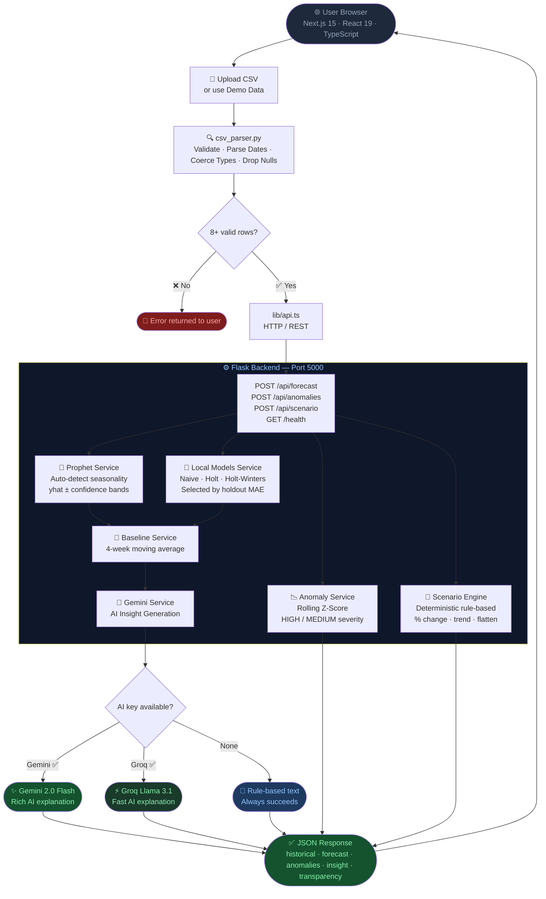
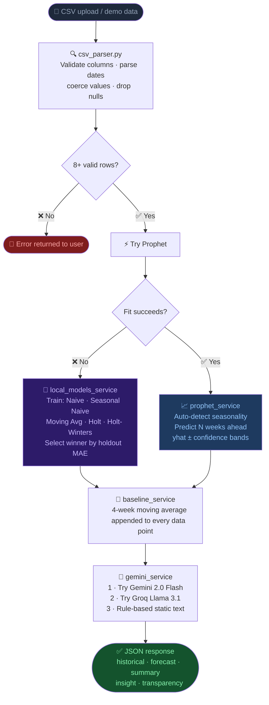
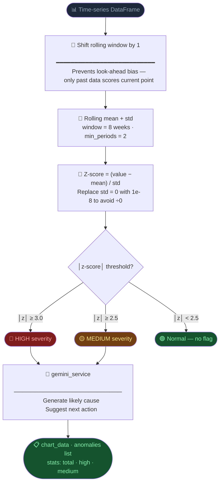
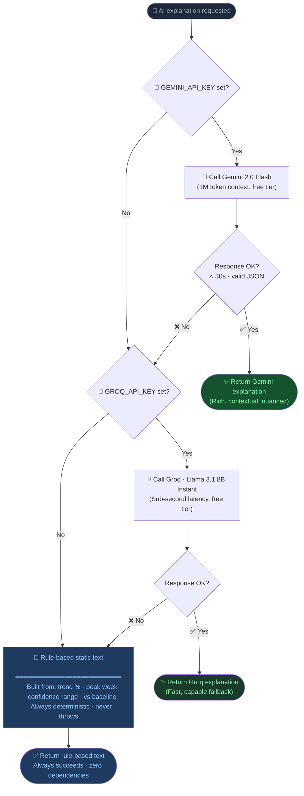
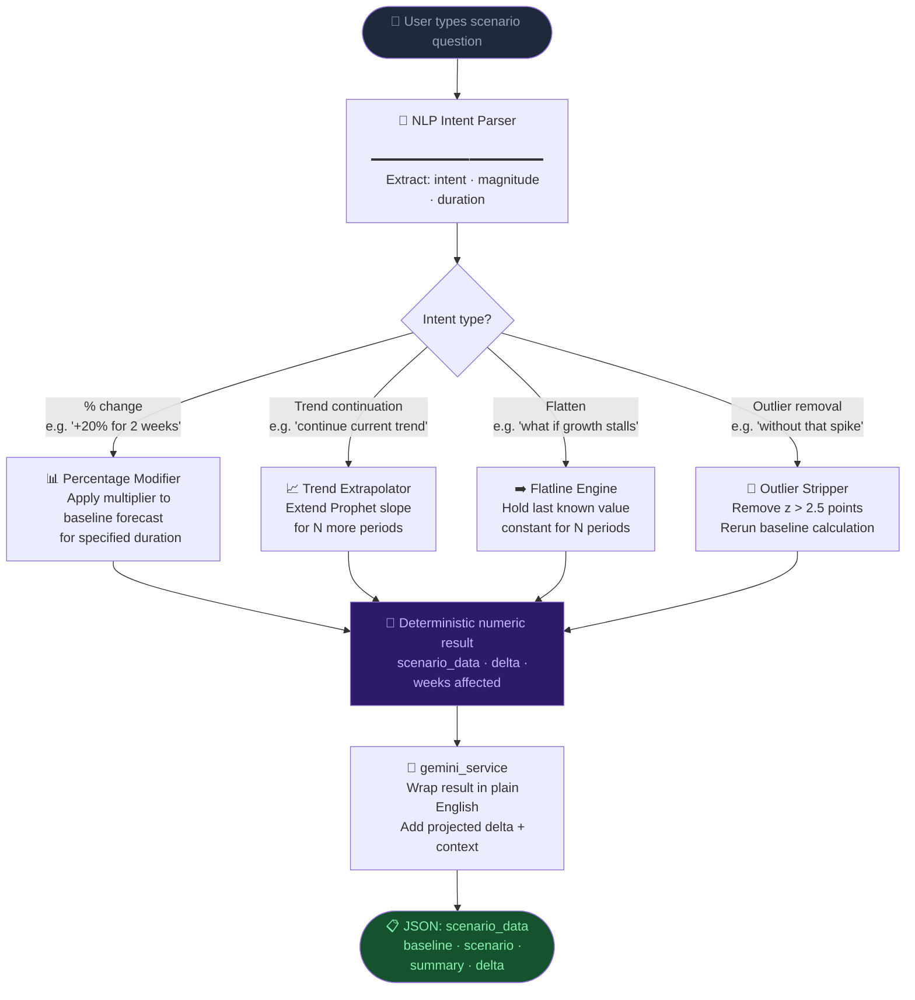
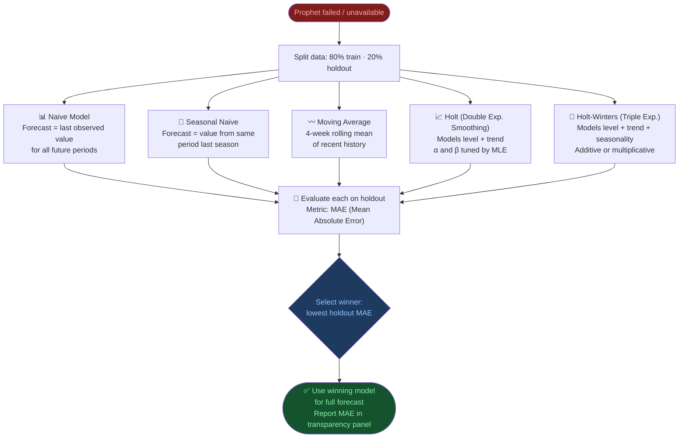

<div align="center">


<a href="https://git.io/typing-svg"></a>

<br/>

[](https://python.org)
[](https://nextjs.org)
[](https://flask.palletsprojects.com)
[](https://facebook.github.io/prophet)
[](https://aistudio.google.com)
[](https://typescriptlang.org)

<br/>

[](LICENSE)
[](https://developercertificate.org/)
[](https://github.com/HimaniMahajan27/ForecastIQ)

</div>

---

<div align="center">

### 💀 Tired of staring at spreadsheets and *hoping* for the best?

**ForecastIQ doesn't do hope. It does data.**

Drop any CSV. Get instant AI forecasts, anomaly alerts, and scenario simulations — explained in plain English. Zero ML knowledge needed. Zero excuses for bad decisions.

> *"Stop guessing. Start forecasting."*

</div>

---

## 🧠 Overview

<table>
<tr>
<td width="33%" align="center">

### 🎯 What It Does
Accepts any time-series CSV → runs Facebook Prophet → returns 4-week forecasts with full confidence bands, anomaly flags, and Gemini AI explanations. All in one click.

</td>
<td width="33%" align="center">

### 🔥 The Problem It Solves
Most teams make million-dollar decisions by eyeballing last month's chart. That's insane. ForecastIQ gives you honest, uncertainty-aware predictions — not vibes.

</td>
<td width="33%" align="center">

### 👥 Who It's For
Business analysts, ops teams, PMs, founders — anyone who needs real forecasting power without a data science PhD or a $50k tool license.

</td>
</tr>
</table>

---

## ✨ Features That Actually Work

> 🟢 Everything below is **live and functional** in the current codebase. No fake features. No cope.

<table>
<tr>
<th>🚀 Feature</th>
<th>💡 What It Does</th>
</tr>
<tr>
<td>📈 <b>4-Week Prophet Forecast</b></td>
<td>Facebook Prophet generates weekly predictions with p10 / p50 / p90 confidence bands</td>
</tr>
<tr>
<td>🎯 <b>Uncertainty Ranges</b></td>
<td>Low / Likely / High bounds on every forecast — because single numbers are a lie</td>
</tr>
<tr>
<td>📊 <b>Baseline Comparison</b></td>
<td>Moving average runs alongside Prophet to catch overfitting before it embarrasses you</td>
</tr>
<tr>
<td>🔁 <b>Local Model Fallback</b></td>
<td>When Prophet is unavailable, the best local model (Naive, Holt, Holt-Winters, Moving Avg) is auto-selected by holdout MAE</td>
</tr>
<tr>
<td>🔍 <b>Outlier-Cleaned Comparison</b></td>
<td>Re-runs forecast with statistical outliers removed for a side-by-side contrast</td>
</tr>
<tr>
<td>🚨 <b>Anomaly Detection</b></td>
<td>Rolling z-score algorithm flags spikes and dips with HIGH / MEDIUM severity + root cause</td>
</tr>
<tr>
<td>🤖 <b>Gemini AI Insights</b></td>
<td>Every forecast explained in plain English by Google Gemini 2.0 Flash — no jargon</td>
</tr>
<tr>
<td>💬 <b>Scenario Chat</b></td>
<td>Ask "What if demand drops 15%?" and get a fully modelled response with numbers</td>
</tr>
<tr>
<td>📂 <b>Smart CSV Upload</b></td>
<td>Drag-and-drop with auto column detection — it figures out your date/value columns itself</td>
</tr>
<tr>
<td>🧪 <b>Instant Demo Mode</b></td>
<td>52-week synthetic dataset pre-loaded — zero setup, works immediately</td>
</tr>
<tr>
<td>🔭 <b>Transparency Panel</b></td>
<td>Every forecast exposes which model was used and its MAE score on holdout data</td>
</tr>
<tr>
<td>🔄 <b>Graceful AI Fallback</b></td>
<td>No Gemini key? Groq kicks in. No Groq key? Rule-based insights fire automatically — the app never fails silently</td>
</tr>
<tr>
<td>🔒 <b>Runs 100% Locally</b></td>
<td>Prophet + anomaly detection = zero API calls, zero data leaves your machine</td>
</tr>
</table>

> **Partial implementation note:** The voice input button (`VoiceButton` component) renders in the Scenario tab UI, but speech-to-text transcription is not yet wired to the chat input. It is a UI placeholder only.

---

## 🏗️ System Architecture



---

## 📊 Data Flow Diagrams

### 1 · Forecast Pipeline



---

### 2 · Anomaly Detection Pipeline



---

### 3 · AI Fallback Chain



---

### 4 · Scenario Engine



---

## 🔬 Prophet Model — How It Works

Prophet decomposes a time series into three interpretable components:

```
y(t) = trend(t) + seasonality(t) + holidays(t) + ε(t)
```

**Why Prophet over a neural network?**

| Property | Prophet | LSTM / Transformer |
|---|---|---|
| **Interpretability** | ✅ Additive components, explainable | ❌ Black box |
| **Training time** | ✅ < 1 second on short series | ❌ Minutes–hours |
| **Data requirement** | ✅ Works with 50+ rows | ❌ Needs thousands |
| **Uncertainty bands** | ✅ Built-in credible intervals | ⚠️ Requires extra work |
| **Seasonality** | ✅ Auto-detected | ❌ Must be engineered |
| **Maintenance** | ✅ No GPU, no retraining pipeline | ❌ Complex MLOps |

Prophet returns three columns for every future date:

```
yhat_lower  ─── Lower bound of 80% credible interval
yhat        ─── Most likely predicted value
yhat_upper  ─── Upper bound of 80% credible interval
```

The wider the band, the less certain the model is — that uncertainty is real information, not error.

---

## 🚨 Anomaly Detection — How Z-Score Works

For each point `t`, the algorithm:
1. Takes the **previous** 8 data points (shifted by 1 to avoid look-ahead bias)
2. Computes rolling mean `μ` and rolling standard deviation `σ`
3. Computes `z = (value - μ) / σ`

| Z-Score | Severity | Meaning |
|---|---|---|
| `│z│ ≥ 3.0` | 🔴 **HIGH** | < 0.3% probability under a normal distribution — very rare |
| `│z│ ≥ 2.5` | 🟡 **MEDIUM** | < 1.2% — worth investigating |
| `│z│ < 2.5` | 🟢 **Normal** | Within expected range — no flag |

**Why shift the window?**
```
Without shift (❌ look-ahead bias):
  Window for point T: [T-7, T-6, T-5, T-4, T-3, T-2, T-1, T]
  Problem: The current point T influences its own baseline → anomalies hide themselves

With shift (✅ correct):
  Window for point T: [T-8, T-7, T-6, T-5, T-4, T-3, T-2, T-1]
  Baseline for T is built from only past points → fair comparison
```

---

## 🔁 Local Model Fallback Selection

When Prophet is unavailable, ForecastIQ trains and evaluates five local models and selects the winner by holdout MAE:



---

## 🛠️ Tech Stack

<table>
<tr>
<th>🏷️ Layer</th>
<th>⚡ Technology</th>
<th>🎯 Why We Chose It</th>
</tr>
<tr>
<td>🖥️ <b>Frontend</b></td>
<td>Next.js 15, React 19, TypeScript, Tailwind CSS v4</td>
<td>Server components + type safety = fewer bugs at 2am</td>
</tr>
<tr>
<td>🧩 <b>UI Components</b></td>
<td>shadcn/ui, Radix UI, Recharts</td>
<td>Accessible, composable, looks clean without fighting CSS</td>
</tr>
<tr>
<td>⚙️ <b>Backend</b></td>
<td>Python 3.11+, Flask 3, Flask-CORS</td>
<td>Lightweight API layer — no overhead, just endpoints</td>
</tr>
<tr>
<td>🔮 <b>Primary Forecasting</b></td>
<td>Facebook Prophet 1.1.5 (runs locally)</td>
<td>Handles seasonality and trend out of the box; trains in &lt; 1s on short series</td>
</tr>
<tr>
<td>🔁 <b>Fallback Forecasting</b></td>
<td>statsmodels (Naive, Holt, Holt-Winters)</td>
<td>No external API; winner selected by holdout MAE</td>
</tr>
<tr>
<td>🚨 <b>Anomaly Detection</b></td>
<td>Rolling z-score via pandas / numpy</td>
<td>Fast, interpretable, explainable to non-technical users</td>
</tr>
<tr>
<td>🤖 <b>Primary AI</b></td>
<td>Google Gemini 2.0 Flash</td>
<td>Free tier, 1M token context, fast inference</td>
</tr>
<tr>
<td>🔄 <b>AI Fallback</b></td>
<td>Groq (Llama 3.1 8B Instant)</td>
<td>Sub-second latency; free tier; auto-triggers if Gemini fails</td>
</tr>
<tr>
<td>✅ <b>Validation</b></td>
<td>Marshmallow (backend), TypeScript (frontend)</td>
<td>Catch bad CSV data before it breaks the model</td>
</tr>
<tr>
<td>🧪 <b>Testing</b></td>
<td>Pytest</td>
<td>Standard Python testing; meaningful coverage on core services</td>
</tr>
</table>

---

## 📁 Project Structure

```
┌─────────────────────────────────────────────────────────────────┐
│  📦 ForecastIQ/                                                 │
│                                                                 │
│  ┌──────────────────────────────────────────────────────────┐   │
│  │  ⚙️  backend/               Flask 3 Python API           │   │
│  │                                                          │   │
│  │  ├── app.py                 App factory + blueprints     │   │
│  │  ├── config.py              Centralised env var loading  │   │
│  │  ├── requirements.txt       Python dependencies          │   │
│  │  ├── demo_sales.csv         52-week synthetic dataset    │   │
│  │  ├── .env.example           Env template (safe to push)  │   │
│  │  │                                                       │   │
│  │  ├── 📂 routes/                                          │   │
│  │  │   ├── forecast.py        POST /api/forecast           │   │
│  │  │   ├── anomalies.py       POST /api/anomalies          │   │
│  │  │   └── scenario.py        POST /api/scenario           │   │
│  │  │                                                       │   │
│  │  ├── 📂 services/                                        │   │
│  │  │   ├── prophet_service.py       Prophet wrapper        │   │
│  │  │   ├── local_models_service.py  5 models by MAE        │   │
│  │  │   ├── anomaly_service.py       Z-score detection      │   │
│  │  │   ├── baseline_service.py      Moving average         │   │
│  │  │   ├── scenario_engine.py       Rule-based scenarios   │   │
│  │  │   ├── outlier_service.py       Outlier comparison     │   │
│  │  │   └── gemini_service.py        AI fallback chain      │   │
│  │  │                                                       │   │
│  │  ├── 📂 utils/                                           │   │
│  │  │   └── csv_parser.py      CSV validation + DataFrame   │   │
│  │  │                                                       │   │
│  │  └── 📂 tests/                                           │   │
│  │      ├── test_anomaly.py    Z-score + severity flags     │   │
│  │      ├── test_baseline.py   Moving average accuracy      │   │
│  │      └── test_csv_parser.py Edge cases + validation      │   │
│  └──────────────────────────────────────────────────────────┘   │
│                                                                 │
│  ┌──────────────────────────────────────────────────────────┐   │
│  │  🖥️  frontend/              Next.js 15 TypeScript App    │   │
│  │                                                          │   │
│  │  ├── package.json           Node dependencies            │   │
│  │  ├── next.config.mjs        Next.js config               │   │
│  │  ├── tsconfig.json          TypeScript config            │   │
│  │  ├── .env.local.example     Frontend env template        │   │
│  │  │                                                       │   │
│  │  ├── 📂 app/                                             │   │
│  │  │   ├── layout.tsx         Root layout + fonts          │   │
│  │  │   ├── page.tsx           Public landing page          │   │
│  │  │   └── 📂 app/            Protected app shell          │   │
│  │  │       ├── layout.tsx     DataProvider + Sidebar       │   │
│  │  │       ├── page.tsx       📈 Forecast tab              │   │
│  │  │       ├── anomalies/     🚨 Anomaly detection tab     │   │
│  │  │       ├── scenario/      💬 Scenario chat tab         │   │
│  │  │       └── upload/        📂 CSV upload page           │   │
│  │  │                                                       │   │
│  │  ├── 📂 components/forecastiq/                           │   │
│  │  │   ├── 📂 charts/                                      │   │
│  │  │   │   ├── forecast-chart.tsx   Actuals + CI bands     │   │
│  │  │   │   ├── anomaly-chart.tsx    Rolling band + flags   │   │
│  │  │   │   └── scenario-chart.tsx   Baseline vs scenario   │   │
│  │  │   ├── anomaly-card.tsx   Severity + cause + action    │   │
│  │  │   ├── csv-upload.tsx     Drag-and-drop + columns      │   │
│  │  │   ├── data-summary.tsx   Forecast data table          │   │
│  │  │   ├── insight-card.tsx   AI insight display           │   │
│  │  │   ├── scenario-chat.tsx  Multi-turn chat interface    │   │
│  │  │   ├── stat-card.tsx      KPI metric cards             │   │
│  │  │   ├── voice-button.tsx   ⚠️ UI placeholder only       │   │
│  │  │   ├── app-sidebar.tsx    Desktop navigation           │   │
│  │  │   ├── app-topbar.tsx     Header + Run Analysis btn    │   │
│  │  │   └── mobile-nav.tsx     Bottom mobile nav            │   │
│  │  │                                                       │   │
│  │  ├── 📂 context/                                         │   │
│  │  │   └── DataContext.tsx    Global state + API results   │   │
│  │  │                                                       │   │
│  │  └── 📂 lib/                                             │   │
│  │      ├── api.ts             All Flask fetch calls        │   │
│  │      ├── demo-data.ts       Fallback demo dataset        │   │
│  │      └── utils.ts           Tailwind cn() utility        │   │
│  └──────────────────────────────────────────────────────────┘   │
└─────────────────────────────────────────────────────────────────┘
```

---

## 🚀 Get It Running

### 📋 Prerequisites

<table>
<tr>
<th>✅ Requirement</th>
<th>📌 Version</th>
<th>📝 Note</th>
</tr>
<tr>
<td>🟢 Node.js</td>
<td>18+</td>
<td>With npm or pnpm</td>
</tr>
<tr>
<td>🐍 Python</td>
<td>3.11+</td>
<td>Required for backend</td>
</tr>
<tr>
<td>🔑 Gemini API Key</td>
<td>Optional</td>
<td>Free at <a href="https://aistudio.google.com/app/apikey">aistudio.google.com</a> — app works without it</td>
</tr>
<tr>
<td>🔑 Groq API Key</td>
<td>Optional</td>
<td>Free at <a href="https://console.groq.com">console.groq.com</a> — secondary AI fallback</td>
</tr>
</table>

> 💡 **No AI keys?** Prophet forecasting and anomaly detection run **100% locally**. AI insights gracefully fall back to rule-based text — the app always produces output.

---

### 1️⃣ Clone the Repository

```bash
git clone https://github.com/HimaniMahajan27/ForecastIQ.git
cd ForecastIQ
```

---

### 2️⃣ Backend Setup

```bash
cd backend

# Virtual environment setup
python -m venv venv
source venv/bin/activate        # macOS/Linux
venv\Scripts\activate           # Windows

# Install dependencies
pip install -r requirements.txt

# Set up environment
cp .env.example .env
# Add your GEMINI_API_KEY and/or GROQ_API_KEY inside .env

# Fire it up 🔥
python app.py
# ✅ Running on http://localhost:5000
```

**Verify it's alive:**
```bash
curl http://localhost:5000/health
# → {"status": "ok", "version": "1.0.0"}
```

---

### 3️⃣ Frontend Setup

```bash
cd frontend

# Install dependencies
npm install

# Set up environment
cp .env.local.example .env.local
# Default works if backend is on port 5000

# Launch 🚀
npm run dev
# ✅ Running on http://localhost:3000
```

Open **[http://localhost:3000](http://localhost:3000)** and you're in. 🎉

---

### 4️⃣ Using The App

<table>
<tr>
<th>📍 Where</th>
<th>⚡ What To Do</th>
</tr>
<tr>
<td>🏠 Landing Page</td>
<td>Hit <b>"Get Started"</b> or navigate directly to <code>/app</code></td>
</tr>
<tr>
<td>🧪 Demo Mode</td>
<td>App auto-loads <code>demo_sales.csv</code> — click <b>Run Analysis</b> on any tab to see it work</td>
</tr>
<tr>
<td>📂 Your Data</td>
<td>Go to <code>/app/upload</code> → drag your CSV → select columns → click <b>Use this data</b></td>
</tr>
<tr>
<td>📈 Forecast Tab</td>
<td>Click <b>Run Analysis</b> — see the Prophet chart, KPI cards, AI insight, and transparency panel</td>
</tr>
<tr>
<td>🚨 Anomalies Tab</td>
<td>Click <b>Run Analysis</b> — flagged spikes and dips appear with severity + cause + action</td>
</tr>
<tr>
<td>💬 Scenarios Tab</td>
<td>Ask <em>"What if demand drops 15%?"</em> — get a modelled response with a comparison chart</td>
</tr>
</table>

---

## 📡 API Reference

> All endpoints at `http://localhost:5000`

| Method | Endpoint | Description |
|---|---|---|
| `GET` | `/health` | Health check → `{"status":"ok","version":"1.0.0"}` |
| `POST` | `/api/forecast` | Run Prophet forecast; auto-falls back to best local model |
| `POST` | `/api/forecast/compare-cleaned` | Rerun forecast with outliers removed for comparison |
| `POST` | `/api/anomalies` | Rolling z-score anomaly detection with AI explanations |
| `POST` | `/api/scenario` | What-if scenario modelling with deterministic engine + AI summary |

All POST endpoints accept `"use_demo": true` to skip uploaded data and use the bundled demo dataset.

---

<details>
<summary><b>🟢 GET /health — Health Check</b></summary>

```json
{ "status": "ok", "version": "1.0.0" }
```
</details>

<details>
<summary><b>🔮 POST /api/forecast — Run Prophet Forecast</b></summary>

**Request:**
```json
{
  "data": [{"date": "2024-01-01", "value": "3500"}],
  "date_column": "date",
  "value_column": "value",
  "periods": 4,
  "use_demo": false
}
```

**Response:**
```json
{
  "success": true,
  "data": {
    "historical": [{ "date": "2024-01-01", "value": 3500, "baseline": 3450 }],
    "forecast": [{ "date": "2024-02-05", "yhat": 4100, "yhat_lower": 3800, "yhat_upper": 4400 }],
    "summary": { "trend_pct": 8.5, "peak_week": "Week 3", "confidence_range": 600, "vs_baseline_pct": 5.2 },
    "insight": "Sales are forecast to grow 8.5% over the next 4 weeks, with a seasonal spike expected in Week 3.",
    "transparency": { "model_used": "Prophet", "local_meta": {} }
  },
  "error": null
}
```
</details>

<details>
<summary><b>🚨 POST /api/anomalies — Detect Anomalies</b></summary>

**Request:**
```json
{
  "data": [{"date": "2024-01-01", "value": "3500"}],
  "date_column": "date",
  "value_column": "value",
  "use_demo": false
}
```

**Response:**
```json
{
  "success": true,
  "data": {
    "chart_data": [{ "date": "2024-04-15", "value": 6200, "rollingMean": 3500, "upperBand": 4900, "lowerBand": 2100, "isAnomaly": true, "anomalySeverity": "HIGH", "deviation": 3.8 }],
    "anomalies": [{ "date": "2024-04-15", "value": 6200, "severity": "HIGH", "deviation": 3.8, "cause": "Spike likely driven by a promotional event or data entry error.", "action": "Cross-check against campaign calendar and verify source data." }],
    "stats": { "total": 1, "high": 1, "medium": 0 }
  },
  "error": null
}
```
</details>

<details>
<summary><b>💬 POST /api/scenario — Model a Scenario</b></summary>

**Request:**
```json
{
  "question": "What if I run a 20% marketing push for 2 weeks?",
  "baseline_forecast": [{ "date": "2024-02-05", "yhat": 4100 }],
  "history": [],
  "use_demo": false
}
```

**Response:**
```json
{
  "success": true,
  "data": {
    "scenario_data": [{ "week": "Week 1", "baseline": 4100, "scenario": 4920 }],
    "summary": "A 20% marketing push is projected to add ~2,800 units over 4 weeks vs. the baseline of 15,900.",
    "delta": 2800
  },
  "error": null
}
```
</details>

---

## 📄 CSV Format

<table>
<tr>
<th>📌 Requirement</th>
<th>✅ Details</th>
</tr>
<tr>
<td>📁 Format</td>
<td><code>.csv</code> with headers in row 1</td>
</tr>
<tr>
<td>🔢 Minimum rows</td>
<td>8 valid data points after cleaning</td>
</tr>
<tr>
<td>📅 Date column</td>
<td>Any parseable format — <code>YYYY-MM-DD</code> recommended</td>
</tr>
<tr>
<td>💯 Value column</td>
<td>Integers or decimals — no text, no nulls</td>
</tr>
<tr>
<td>📆 Frequency</td>
<td>Weekly works best — daily also supported</td>
</tr>
</table>

```csv
date,sales
2023-01-02,3421
2023-01-09,3689
2023-01-16,3512
2023-01-23,3780
```

---

## 🔐 Environment Variables

> ⚠️ **Never commit `.env`** — only `.env.example` goes to GitHub.

**Backend (`backend/.env`)**

<table>
<tr>
<th>🔑 Variable</th>
<th>📌 Required</th>
<th>📝 Description</th>
</tr>
<tr>
<td><code>GEMINI_API_KEY</code></td>
<td>⭐ Recommended</td>
<td>Google Gemini key for AI insights</td>
</tr>
<tr>
<td><code>GEMINI_MODEL</code></td>
<td>No</td>
<td>Default: <code>gemini-2.0-flash</code></td>
</tr>
<tr>
<td><code>GROQ_API_KEY</code></td>
<td>No</td>
<td>Auto-fallback if Gemini fails</td>
</tr>
<tr>
<td><code>FLASK_ENV</code></td>
<td>No</td>
<td><code>development</code> or <code>production</code></td>
</tr>
<tr>
<td><code>FLASK_SECRET_KEY</code></td>
<td>✅ Yes (prod)</td>
<td>Strong random string for Flask sessions</td>
</tr>
<tr>
<td><code>FRONTEND_URL</code></td>
<td>No</td>
<td>CORS origin (default: <code>http://localhost:3000</code>)</td>
</tr>
</table>

**Frontend (`frontend/.env.local`)**

<table>
<tr>
<th>🔑 Variable</th>
<th>📌 Required</th>
<th>📝 Description</th>
</tr>
<tr>
<td><code>NEXT_PUBLIC_API_URL</code></td>
<td>No</td>
<td>Flask URL (default: <code>http://localhost:5000</code>)</td>
</tr>
</table>

---

## 🧪 Running Tests

```bash
cd backend
source venv/bin/activate   # if not already active

# Run all tests
pytest tests/ -v

# Run individual test files
pytest tests/test_anomaly.py -v
pytest tests/test_baseline.py -v
pytest tests/test_csv_parser.py -v
```

**Test coverage:**

- `test_anomaly.py` — z-score threshold correctness, HIGH/MEDIUM severity flags, shift correction (no look-ahead), rolling band computation, std=0 edge case
- `test_baseline.py` — 4-week moving average accuracy, alignment with forecast dates, short-series handling
- `test_csv_parser.py` — missing column detection, non-numeric value rejection, unparseable dates, minimum 8-row enforcement, duplicate date removal, null row dropping

---

## ⚠️ Known Limitations

> Honest about what's not done — because integrity > hype.

- 🎙️ **Voice input** — the `VoiceButton` component renders in the Scenario tab but speech-to-text is not wired to the chat input. It is a UI placeholder only.
- 📏 **Min data** — fewer than 8 valid rows will be rejected by the parser.
- ⏱️ **Frequency** — hourly / sub-daily data is not supported yet.
- 🪟 **Windows + Prophet** — may need [Microsoft C++ Build Tools](https://visualstudio.microsoft.com/visual-cpp-build-tools/) to install Prophet.
- 🌐 **No persistence** — session-based only; no saved forecast history across page reloads.
- 📄 **CSV only** — `.xlsx`, JSON, and database connections are not supported.

---

## 🐛 Troubleshooting

<details>
<summary><b>🔴 Backend won't start</b></summary>

| ❌ Error | ✅ Fix |
|---|---|
| `ModuleNotFoundError: prophet` | `pip install prophet` — on Apple Silicon: `brew install cmake` first |
| `ModuleNotFoundError: google.generativeai` | `pip install google-generativeai==0.7.2` |
| `ModuleNotFoundError: groq` | `pip install groq==0.9.0` |
| Port 5000 in use | Change `port=5000` in `app.py` and update `NEXT_PUBLIC_API_URL` |

</details>

<details>
<summary><b>🟡 Frontend errors</b></summary>

| ❌ Error | ✅ Fix |
|---|---|
| `Cannot find module '@/context/DataContext'` | Confirm `frontend/context/DataContext.tsx` exists after cloning |
| `Network Error` / CORS in console | Check `FRONTEND_URL` in `backend/.env` exactly matches Next.js URL + port |

</details>

<details>
<summary><b>🟠 API returns success: false</b></summary>

| ❌ Message | ✅ Fix |
|---|---|
| `"Only N valid rows found"` | CSV has fewer than 8 clean rows — check blanks, bad dates, non-numeric values |
| `"Date column 'X' not found"` | Use the Upload column selector to pick the correct column names |
| Gemini errors in backend logs | App falls back to Groq then rule-based text automatically — set `GEMINI_API_KEY` for full AI |

</details>

---

## 🚢 Production Deploy

```bash
# 🐍 Backend — swap Flask dev server for gunicorn
pip install gunicorn
gunicorn -w 2 -b 0.0.0.0:5000 app:app

# 🖥️ Frontend — static build
npm run build
npm start
```

**Pre-deployment checklist:**

```bash
# Generate a strong Flask secret key
python -c "import secrets; print(secrets.token_hex(32))"

# Update backend/.env
FLASK_ENV=production
FLASK_SECRET_KEY=<generated value>
FRONTEND_URL=https://your-production-domain.com

# Update frontend/.env.local
NEXT_PUBLIC_API_URL=https://your-api-domain.com
```

> 🔒 Never ship `.env` or `.env.local`. Both are already listed in their respective `.gitignore` files.

---

## 🔭 What's Next

> If we had more time, here's what's coming:

- 🎙️ Wire `VoiceButton` to the Web Speech API for hands-free scenario questions
- 📊 Visual side-by-side scenario comparison charts
- 📅 Monthly + hourly data frequency support
- 👤 Saved forecast history across sessions
- 📧 Real-time anomaly email / Slack alerts
- 📁 Excel (`.xlsx`) and JSON file upload support
- 🌍 Multi-dataset comparison across regions or products
- 📥 `/api/forecast/export` endpoint to download results as CSV

---

## 📄 License

Apache License 2.0

All commits are DCO signed-off (`git commit -s`) as required by the NatWest Code for Purpose Hackathon submission guidelines. This project is submitted in a personal capacity and is not official company work.

---

<div align="center">


**Built with 🔥 for NatWest Code for Purpose — India Hackathon 2026**

[](https://github.com/HimaniMahajan27/ForecastIQ)
[](https://github.com/HimaniMahajan27/ForecastIQ)

*Stop looking backwards. Start forecasting forward.* 🚀

</div>
